# project2
fitlife-master website
# project-documentation


<p align="center">
  <a href="" rel="noopener">
 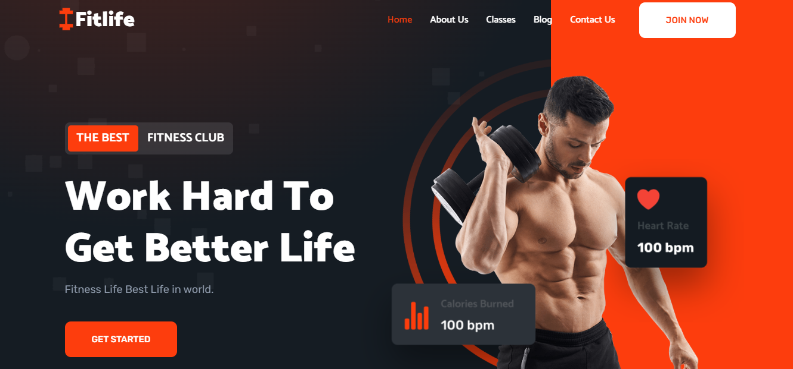</a>
</p>

 <h2 align="center">Fitlife-master Website</h2>

---

<p align="center"> fitlife-master responsive restaurant website, <br />Responsive for all devices, build using HTML, CSS, and JavaScript.
    <br> 
</p>

## 📝 Table of Contents
- [About](#about)
- [Getting Started](#getting_started)
- [Authors](#authors)
- [Acknowledgments](#acknowledgement)

## 🧐 About <a name = "about"></a>
Fully Functional responsive restaurant website. The technologies used in this project are javascript. The data is accessed locally using static html template, I am updating to api so that it can be accessed dynamically. I took almost 40 - 50 hrs to complete this project. SkillLync helped me by providing the strutures and technically   for all relevant feature pages.


## 🏁 Getting Started <a name = "getting_started"></a>
These instructions will get you the project and running on your local machine for development and testing purposes.

### Prerequisites
This project was create with Create visual studio.

```
Visual studio code is required.
```
### Installing 

In the project directory, you can run:

### Run Locally

To run **fitlife-master** locally, run this command on your git bash:

Linux and macOS:

## ✍️ Authors <a name = "authors"></a>
-Sowndar raj K

## 🎉 Acknowledgements <a name = "acknowledgement"></a>
- Hat tip to anyone whose code was used
- restaurant website
- online booking chris available

## 🎉 Screenshots <a name = "Screenshots"></a>

 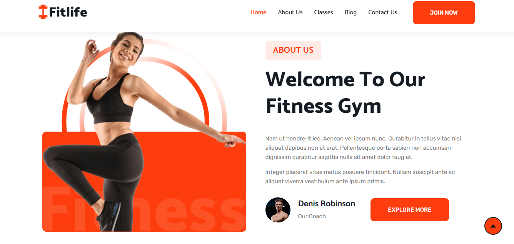</a>
 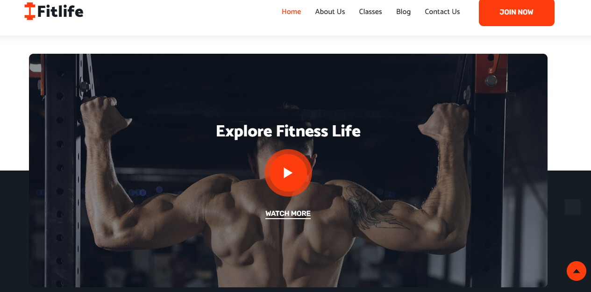</a>
 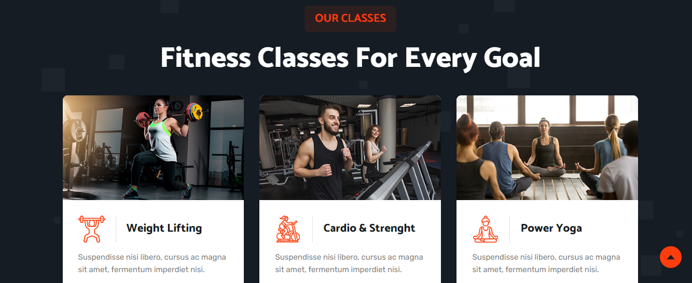</a>
 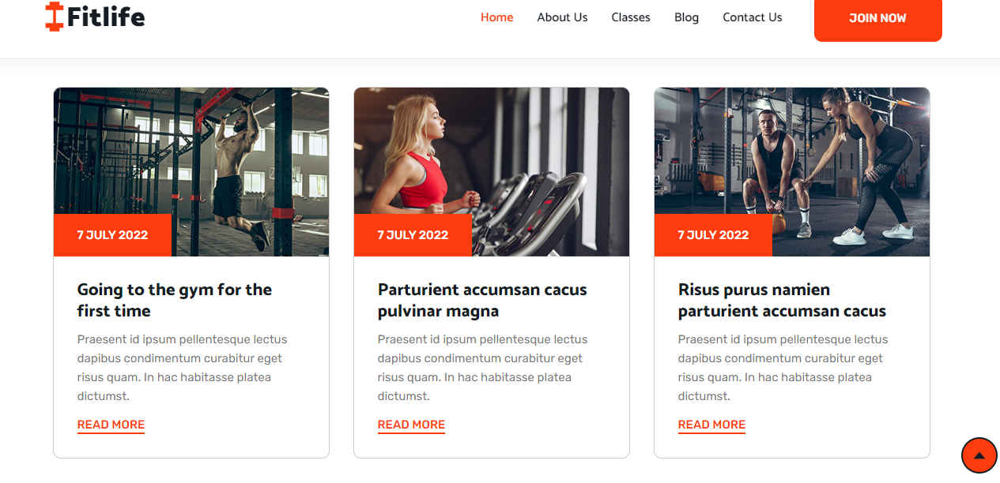</a>
 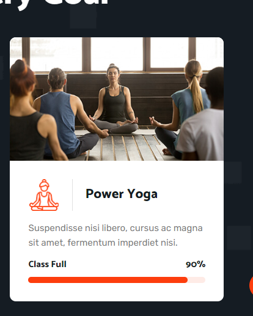</a>
 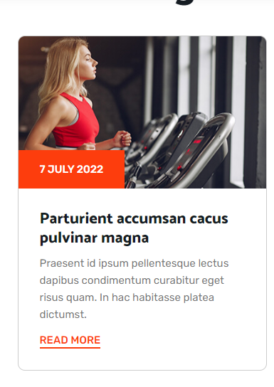</a>
 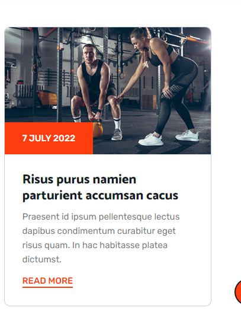</a>
 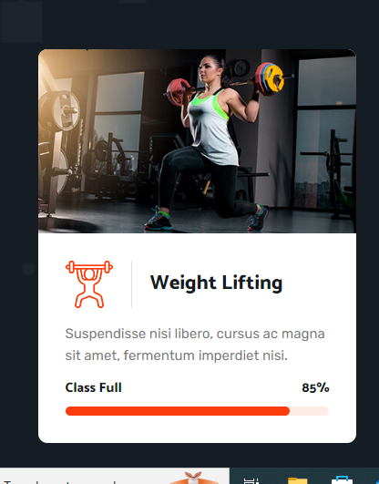</a>
 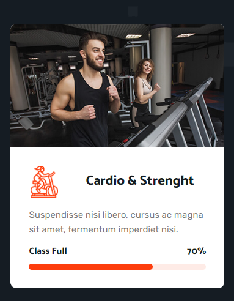</a>
 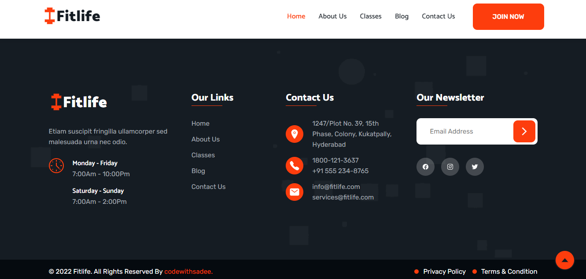</a>
